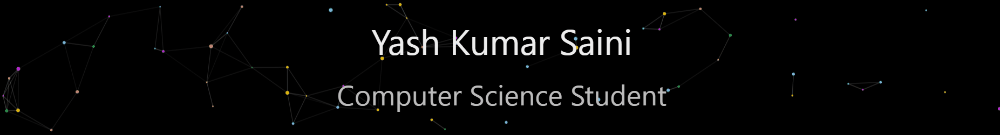

<h2 align="center">👋 Hi, I'm Yash</h2>
<h4 align="center">Undergrad exploring the intersection of AI, Machine Learning, and real-world applications.</h4>
<h4 align="center">I'm currently pursuing B.Tech in Computer Science (Data Science & Analytics) at IIIT Nagpur.</h4>

--- 

Right now, I'm diving deeper into:
- 🧠 **Agentic AI** and autonomous system design  
- 🗣️ **LLMs**, prompt engineering, and RAG pipelines  
- 🤖 **Generative AI** and multimodal applications  
- 🧮 **Deep learning** foundations and model development

---

## 🛠 Languages & Tools I Use

| Languages | Tools & Libraries | Platforms & APIs |
|----------|-------------------|------------------------|
|      |            |      

--- 

## 🌐 Connect with Me

  
  

